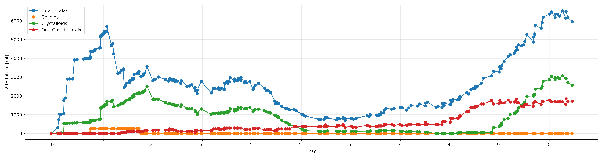

# Fluid Balance Estimation in MIMIC-IV
A re-adaptation of the code found in [mimic-iv/concepts/fluid-balance](https://github.com/MIT-LCP/mimic-code/tree/fluid-balance/mimic-iv/concepts/fluid-balance).  
Tested on BigQuery, MIMIC-IV version 2.2.

This code generates two tables: `fluid_rates` and `fluid_amounts`, reporting respectively rates in `ml/hour` and amounts in `ml` for different selected order categories.




### Requirements
1. Access to MIMIC-IV. Learn more [here](https://mimic.mit.edu/docs/gettingstarted/).
2. Project ID of a Google Project, make sure to have the necessary IAM permissions to run queries on Big Query.
3. Ensure that the [Google SDK](https://cloud.google.com/sdk?hl=it) is properly installed in your environment with proper authentication.

__Important Note__: The google account enabled to access the MIMIC-IV must the be same as the one associated with the Google Project.

### Installation 
Run:   
```python
pip install "git+https://github.com/jhn-nt/mimic-iv__fluid-balance.git"
```

To generate the `<your project-id>.mimiciv_derived.fluid_rates` and `<your project-id>.mimiciv_derived.fluid_amounts`  tables in your BigQuery, run:
```python
python3 -m mimiciv__fluid_balance -p <your project-id>
```

### Manual Installation
If you do not have access to a GCP authenticated environment, you can manually add the tables to your Big Query (or any other database).   
The procedures to build the tables are defined in `mimiciv__fluid_balance/fluid_rates.sql` and  `mimiciv__fluid_balance/fluid_amounts.sql`.  
The former should be built first.


## Acknowledgements
1. Johnson, Alistair, et al. "Mimic-iv." PhysioNet. Available online at: https://physionet. org/content/mimiciv/1.0/(accessed August 23, 2021) (2020).  
2. Johnson, Alistair EW, et al. "MIMIC-IV, a freely accessible electronic health record dataset." Scientific data 10.1 (2023): 1.
3. Johnson, Alistair EW, et al. "MIMIC-III, a freely accessible critical care database." Scientific data 3.1 (2016): 1-9.